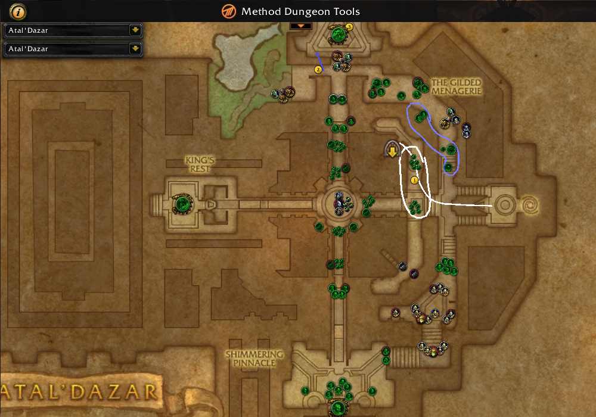

# Murder the Saurids



1. Pull both saurid packs
1. Rezan **Lust**
1. Pack that was to the left when we zoned in
1. Stalker and honor guard and shieldbearers when they patrol close
1. Stalker and middle pack (CC infested honor guard)
1. Honor guard pack close to stairs (CC infested witch doctor)
1. Kill infested honor guard and witch doctor
1. Around the outside of the stairs, warlock gate to Vol'kaal
1. Warlock gate out of Vol'kaal, jump onto stairs
1. Stalkers & pack at bottom of stairs (CC infested). **Lust**
1. Saurid and screamer packs (CC infested) after gate
1. Go left, screamer and saurid pack. We would come through this way if we
  wipe anywhere after Vol'kaal
1. Both perched screamers and saurid pack south of center ring
1. Screamer and saurid pack (CC infested)
1. Double augur and honor guard pack (CC infested)
1. Dodge the fire
1. Pack at top, CC augur, pull the rest (including priestesses)  **Lust**
1. Pull augur and juggernaut off to the side (gives things time to come off cooldown)
1. Priestess Alun'za
1. Yamza

```
dmtwDaGAuPOA9OsbEPqq1UOSnbZuiOmBuH(gj7uAVQDlK0(rf1WezCqnuuPqnyurgUqqog4CIAHOsAPOsrSyHu1YrLQEkXJfs45cPmruPinvHAYOcmDu1Vrf0Zq56cH2OqIUmQeBwiA7OsPAzunluPqMgKVJkL4WcbUgYOrLsA8OsPCsuPGUfPoTqQ4RcPsFgvQ0RrLkUnQuuE44fom65MZLOGpAhFHJx44XxyHOKPU(I2DKHVSfcHn8fTODiBWLwie2W3WI2HSbx1cHcw4Ix0oGm)MxiuWcxiTODaz(fGfcXm6c(I2tzZVaBHqmJUaAr7PS5xGwig2cxiSO9e2OlOwig2cxaVO9e2OlKxigy4RNw0oKS01HfIbg(6(I2HKLUoBHCL5xhTODGm11PfYvMF9WI2bYuxxTqozQRJx0UJS01ZlKtM6YslA3rw6YGfYdgCz(I2zjdFzSfYdgCzOfTZsg(YOfYdgDzHfTZug7YulKhm6YWlANPm2LLxixz(fLw0okB4lcwixz(f5lAhLn8fXwixzHlcTODIm4IOfYvw4IclANidUi1c5ydFr4fThalFr5fYXg(sPfThalFjyHyjJDjFr7bL5xITqSKXUeAr7bL5xIwigy4lfw0UYn4sQfIbg(s4fTRCdUuEHyidFdPfTRug6gGfIHm8n4lAxPm0nWwiw2s3aAr7y3u3aTqSSLUHWI2XUPUb1cHyw(gWlAhtw6gYleIz5RkTODmzPRcwie2ORYx0oMS0vXwie2ORcTODmzPRIwiczWvfw0oMzWvPwiczWvHx0oMzWvLxisz0fNw0UszPlgwisz0f7lAxPS0fZwicBSlgTODfyQlMwicBSloSODfyQlwTqe2uxmEr7bL5xCEHiSPU50I2dkZVzyHiLLVzFr7u2c3mBHiLLVz0I2PSfUzAHOGHV5WI2jMfUz1crbdFZ4fTtmlCZ5fIcw6cP0I2rklFHeSquWsxi5lAhPS8fsSfIitDHeAr7iWGlKOfIitDHuyr7iWGlKulerg7cj8I2zbdUqkVqezSlaPfTZcgCbawicz0faFr7SKbxayleHm6caAr7SKbxaOfIyg6cqyr7oz(fa1crmdDbaVODNm)cqEHi3cxWtlA3twy(fo44lCdx)cgCzx4IMRxAjYiJmYiJ8gUA8vnxNF(RF8suNRlCWXx4OePcihtmMIbEMWhPgXU(rPghaegbowfYKtOJuJOl7cx0C9slryrmA8CJ4mNIy04cN5exIkhWzoXHrYzoXXignEoZjomQCMtCt4c3GiiQZp)LD8chp(clbhzORVODLBOlBjazdUOfTRClDPLaKn4gw0UYT0vTeaWqx8I2vULU5Laag6cPfTRClDbyjKCdUGVODfyQlWwcj3GlGw0Ucm1fOfktg6cHfTRadDb1cLjdDb8I2vGHUqEHWkdF90I2vGLUoSqyLHVUVODfyPRZwimZWxhTODvYuxNwimZWxpSODvYuxxTqQSHUoEr7QKHUEEHuzdDzPfTRsg6YGfsrg6Y8fTRsg6YylKIm0LHw0UkzOlJwOq2Wxwyr7HSHUm1cfYg(YWlApKn0LLxOaZWxuAr7bLPUiyHcmdFr(I2dktDrSfIYgCrOfThilDr0crzdUOWI2dKLUi1cridFr4fThalDr5fIqg(sPfThalDjyHiWqxYx0ofS0Lylebg6sOfTtblDjAHqydDPWI2PKHUKAHqydDj8I2PKHUuEHqbdUH0I2rKLUbyHqbdUbFr7iYs3aBHqidFdOfTZYg6gOfcHm8new0olBOBqTqiKb3aEr7mKPUH8cHqgCvPfTZqM6QGfcXm8v5lA3ZM6QyleIz4RcTODpBQRIwiKB4RkSODNm0vPwiKB4RcVODNm0vLxiuYGloTODpzOlgwiuYGl2x0UNm0fZwiwWWxmAr7azOlMwiwWWxCyr7azOlwTqmMbxmEr7ayPloVqmMb3CAr7ayPBgwihB4B2x0EkyQBMTqo2W3mAr7PGPUzAHCYW3Cyr7jYsZVWbhFHlD9lyWLDHlAUEPLiJmYiJmYB4Qvx1CD(5VOJx44XxyHiSHV(IgWG5x2crydUOfnOiJU0crydUHfnOiJUQfIidFXlAqbMFZlerg(cPfnOaZVaSqKB0f8fnecg(cSfICJUaArdHGHVaTqiLHVqyrdbM5xqTqiLHVaErdbM5xiVqi3ORNw0qam66WcHCJUUVOHay01zletz4RJw0qWn660cXug(6HfneCJUUAHymJUoErdbLHVEEHymJUS0IgckdFzWcXyg(Y8fnOCJUm2cXyg(YqlAq5gDz0cXqgDzHfnOuMFzQfIHm6YWlAqPm)YYlelyWfLw0a2n8fblelyWf5lAa7g(IyledBWfHw0awz0frledBWffw0awz0fPwiKBWfHx0qgm8fLxiKBWLslAidg(sWcHugDjFrd5G5xITqiLrxcTOHCW8lrle5gCPWI2tjdFj1crUbxcVO9uYWxkVqez4BiTO9ez0nalerg(g8fTNiJUb2cfsgCdOfTNYg(gOfkKm4gclApLn8nOwOaYW3aEr7aZOBiVqbKHVQ0I2bMrxfSqQKbxLVODiy4RITqQKbxfAr7qWWxfTqkKbxvyr7q28RsTqkKbxfEr7q28RkVqkYOloTODNz(fdlKIm6I9fT7mZVy2cPyg(IrlA3XMFX0cPyg(IdlA3XMFXQfsXm4IXlAN5MFX5fsXm4MtlAN5MFZWcPqgDZ(I2zkZVz2cPqgDZOfTZuMFZ0cPWg(MdlANLn)MvlKcB4BgVODw28BoVqyMbxiLw0olB(fsWcHzgCHKVODw28lKylegBWfsOfTZyMFHeTqySbxifw0oJz(fsQfcNn4cj8I2DYWxiLxiC2GlaPfT7KHVaaleoBWfaFr7EYOlaSfcNn4caAr7EYOla0cHXg(cqyr7aYOlaQfcJn8fa8I2bKrxaYlewzWf80I2tzdFbhwiSYGl4(I2tzdFbNTqyKbxWrlAprMFbNwimYGl4HfTNiZVGRwiCYGl44fTNCZVGNxiCYGlWslAp5MFbgSqkYGlW8fnKXg(cm2cPidUadTOHm2WxGrlKkz0fyHfnKvgDbMAHujJUadVOHSYOlWYluGm8fqPfnKrgDbeSqbYWxa5lAiJm6ci2cfsgDbeArdySHVaIwOqYOlGclAaJn8fqQfIug(ci8IgWmZVakVqKYWxGslAaZm)ceSqeYWxG8fnOiZVaXwicz4lqOfnOiZVarleHm4cuyrdkWO5x4GJVWLU(fm4YUWfnxV0IIu5iJ8gUA8vnxNF(lD8chC8fU01VWLDHlAUEPfwKOCKrEdxnE(f(JVWvdgKZjmoKyykLNFHJhFHfecz01x0GJn)YwqSGHVOfnKWgn)83WXlrDUUWbhFHJsLkPigbafaiNWhPgHU(rPgJjgghqzf5HKNosnkCzx4IMRxAjkJyuWD4mN45wJorJZCkcfroYrJZCk6gbCph5WOG7WzoXDJaEUWzoXZHCMtrphgTOzCMtr4rhoYroZPONdJw0moZPOBeW9CKdJcUdN5e3nc45cN5ehgrEB(5VQJxI6CDHdo(chLypZqKtkkOikahPgHU(rPMcocdmcWEitk8rQrHl7cx0C9slryrmA8CMtCyu5mNIqCRrq04cN5u04wIGi08ZFXhVWbhFHRF9lyWLDHlAUEPLiJmLsr)nC14RAUo)chp(cletzSRVObuYyx2cXilDrlAabg7sleJS0nSObeySRAHyUPU4fnGCJDZleZn1fslAa5g7cWcXsg6c(IgqmJDb2cXsg6cOfnGyg7c0c5ydUqyrdiKHUGAHCSbxaVObeYqxiVqoz5RNw0aIm01HfYjlFDFrdiYqxNTqoZcxhTObuWqxNwiNzHRhw0akyORRwihm21XlAaPm665fYbJDzPfnGugDzWcbzlDz(IgqyJUm2cbzlDzOfnGWgDz0cbbtDzHfnGYgDzQfccM6YWlAaLn6YYleGm6IslAGsgDrWcbiJUiFrduYOlITqGB(fHw0abw4IOfcCZVOWIgiWcxKAHszlFr4fnqUfUO8cLYw(sPfnqUfUeSqjLfUKVObIzHlXwOKYcxcTObIzHlrluIm2LclAGqw4sQfkrg7s4fnqilCP8cLygCdPfnqKPUbyHsmdUbFrdezQBGTqj38BaTObkyW8ZFZhVWbhFHRF9lyWLDHlAUEPLi5Gizrg5nC14RAUo)chp(clOqYGRVOHaYqx2ckKm4Iw0qiy5lTGcjdUHfnecw(QwqHKbx8IgczdDZlOqYGlKw0qiBOlalOqYGl4lAqbw(cSfuizWfqlAqbw(c0ckKm4cHfnOqg6cQfuizWfWlAqHm0fYlOqYGRNw0Gky5RdlOqYGR7lAqfS81zlOqYGRJw0GkBORtlOqYGRhw0GkBORRwqHKbxhVObmy5RNxqHKbxwArdyWYxgSGcjdUmFrdy3qZp)8lClCHlCNl4lC7rahJixoEjkIi3Z9CjQ8CJJih54nVefrK75EUevEjIrph5c3ox44fwIIiY9CpxIkp30igvUlx4WOYnKd42UaTWZfUWnl6evU7r)sekICKJr74lC8fqhFHR663WLDXx0fsx6MVHl6QU(fFz38LUq6cZp)1p(cHJVWfMF(l74lC8fU(1VW8x)4lCH5VoC8fU(1VW8ZFrhFXhFHlm)fshFHlm)nF8fUW8ZFPJVGF8fU(1VS5N)go(cWXx46ZFXhFHRp)fshFHlB(l4hFHlA(B(4lCzZp)vD8fGJVWLn)fF88xiD8fUO5VGF8fU01VH5V5JVWfn)8x8XxGD8fUW8ZFZhFXhFHl76x08ZFH0Xx8Xx4IV(LM)c(Xx4QU(fp)fGJVWvD9By(5VaC8fqhFHR7x)6Ol76WfDD6sxNn)fOJVWvn)8xWp(c0Xx4gM)cOJVW1tx)cHl7cQl6c4lDH88ZFb2XxaoE(lqhFHlC9B(YUqA(lKoE(l4hp)fqhFHlqx)c(LDb0fDb4sxGn)nF88ZFb0XxGo(cx66x08xaD8fUo(6xxDzxpFrxpCPlln)8xGo(cOJVWL5x)Yyx2LHUOldM)c0Xx4INF(leo(chFHB46x18x0Xx4gU(vn)8xqD8fo(cx21VOl7sZF9JVWnp)LD8fU08x0Xx4sZFdhFHl76x0LDHl66Zp)fWhFvhFHlm)8xiF81p(cx88x0Xx4INF(RNo(6PJVWfMF(5NFHNlCB8lrxWN)b
```
